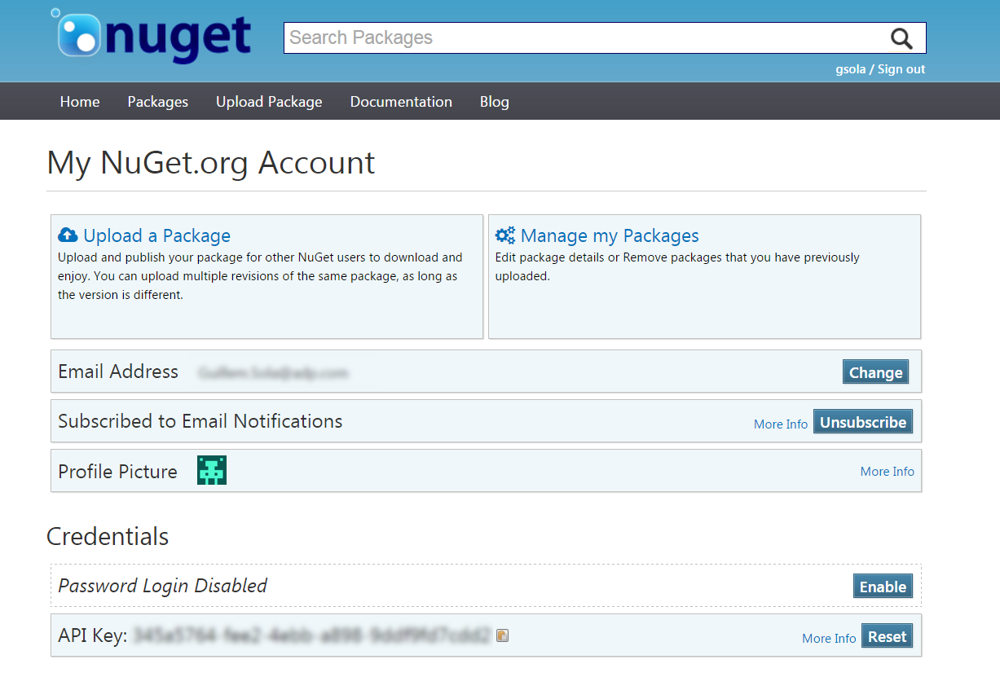
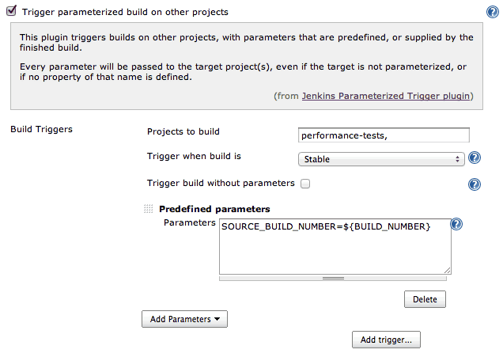

# Exercise 1

## Separate release cycle for all three components

### Repositories and jobs organization

As release cycles are not tight each component is a product with it's full life cycle and can be modified and updated on demand. For the source code I will create three different git repositories, one for each component, on whatever git server we have like Bitbucket, github, TFS... 

Similarly on Jenkins we are going to create three jobs to perform the different activities needed to produce a validated artifact: build, static analysis, tests, delivery... As the three projects share the  same technology the pipelines will be quite similar. This way every time we want to produce a snapshot or release version we will need just to trigger the Jenkins job.

If we want to have CI we will need to integrate Jenkins with the SCM of choice with the proper hook plug-in. In this way, and with a proper branch organization it will be possible to cover the whole development life cycle for each product.

## Dependencies management

As one of the three projects that we own is used as a dependency and has an independent life cycle, I will suggest using Nuget, the standard package manager for .NET technologies, to manage them. There are several ways to share Nuget packages, from a shared folder to commercial solution like JFrog Artifactory. Each solution has it's pros and cons concerning costs, simplicity, reliability... Assuming that we don't have another artifact management system like Nexus or Artifactory I will install one of the open source .NET Foundation solutions.

This will be the architecture fot the solution

<svg xmlns="http://www.w3.org/2000/svg" xmlns:xlink="http://www.w3.org/1999/xlink" width="489px" version="1.1" content="&lt;mxfile userAgent=&quot;Mozilla/5.0 (Windows NT 10.0; WOW64) AppleWebKit/537.36 (KHTML, like Gecko) Chrome/56.0.2924.87 Safari/537.36&quot; version=&quot;6.2.4&quot; editor=&quot;www.draw.io&quot; type=&quot;github&quot;&gt;&lt;diagram name=&quot;Page-1&quot;&gt;7Zlbc6M2FMc/jR/LgLgYP9reTXY63U6meej2qSODDNoAYoR8ST99j5BkAyKJ02I37XQzs5GO0IX/70hHh8z8dXm857jOv7KUFDPkpseZ/2mG0MKN4H9peFaGuRcqQ8Zpqkze2fBI/yDa6Grrjqak6T0oGCsErfvGhFUVSUTPhjlnh/5jW1b0Z61xRizDY4IL2/orTUWurDGKzvYvhGa5mdmLFqplg5OnjLNdpeebIX/b/lPNJTZj6RdtcpyyQ8fkf575a86YUKXyuCaFlNbIpvrdvdB6WjcnlbikA1Id9rjYEbPidl3i2WgBS6xlkZataKv297Kple4uWLCpbOmRwMCrPeGCgpo/4Q0pHlhDBWUVtG+YEKzsPLAsaCYbBKvNyFDLhZCcl3LZ6O47qZ5o1TiUQaV9pIECQlF9/OFH1fZ7wTLmNPvMqasMBrJV0MLIecmxY9Kq3BNWEsGf4RHd6htC2oOR66v64ewPYaxMeccVYt0Naw/MTiOfKUBBgxiH4ltQHjj7LiVG7nKMj3IhiSLFTS4RtJVclDDFJw+KjeDsiaxZwThYKlZJksUATwJyEf7X+RlPKY+ZPBUctt3ShDiwSRNSi8aR27Adf0uLwqxlJqWeo1UM9nbjnJafsJImujwBUc8Pe0QXrg3UtYEG4d8HGrwCdDUh0IGuoSt//knQNwXqR7cjGllEH3N4l3SGIlxKiapNU7evGRVCYqR7KGayWNANx3I21QIzdRr/g7t7frdaBujWznCKsDdwhvnbQZRU6VLeSySHAjeNfPUuQXKk4pssOy7S1d+kOE4Yx7r+QDiFpUmJW9FAK/78rVtRPVD4mqIN2/GE9OKMwDwjoncfIGnvfmSr/oaqxsZJgQXd929VY1LrGR4YrUQHatAPwsFiEF3V2+he3WvOYCAUvBDNzUBKA2uglvzptS9yhngCZ3iB7MVgow8PdhH1eHhmye8GGw/AegMPmQ7s4npg5xeTDT4+2cE5HCInnMceGpyzlwL2/QHg8Go717hO95q22xQAEbm/kFoGSqYDw2v50ZvhtQ3Mq1Oi2AmVOlV8KQJbeZadio2nUBwfnIyKfLfZNYRDxBbgYxC5S2j7eXcPnoTuvoBUUiHcyBADfYhCJJOtagcST5dbBbHf3/2BHas988Wg66P+BMHa82zKnO6xIP9jvi7msYzrepjtnOuy47qBA0VcNzwj+xA3XvlRTvGpLl7eYjBQcLX4bDxpkgDtjdypzR3d7V3QL4/dJr584OD9b8Rup+IW9kNOBXmscUviANlrn3o/MT1l3N4gS+3mtTrHhkw4pcB8YJ7g8PS8voLzkbMTjXiCP8UHSM++695Tifdx/dUSF15IvPPblDZhHfasLxMmHpY0TeU0qzGAF1K7DYuxTYneT0IG5NO3f7UZzn9f8T//CQ==&lt;/diagram&gt;&lt;/mxfile&gt;" onclick="(function(svg){var src=window.event.target||window.event.srcElement;while (src!=null&amp;&amp;src.nodeName.toLowerCase()!='a'){src=src.parentNode;}if(src==null){if(svg.wnd!=null&amp;&amp;!svg.wnd.closed){svg.wnd.focus();}else{var r=function(evt){if(evt.data=='ready'&amp;&amp;evt.source==svg.wnd){svg.wnd.postMessage(decodeURIComponent(svg.getAttribute('content')),'*');window.removeEventListener('message',r);}};window.addEventListener('message',r);svg.wnd=window.open('https://www.draw.io/?client=1&amp;lightbox=1&amp;edit=_blank');}}})(this);" viewBox="0 0 489 384" style="cursor:pointer;max-width:100%;max-height:384px;"><defs/><g transform="translate(0.5,0.5)"><image x="209.5" y="132.5" width="58" height="80" xlink:href="https://jenkins.io/images/226px-Jenkins_logo.svg.png" preserveAspectRatio="none" pointer-events="none"/><path d="M 51.52 25.99 L 57.25 20.73 C 57.78 20.28 58.38 20.01 59.11 20 L 72.04 20 C 73.39 20 75 21.12 75 23.03 L 75 25.99 Z M 25 65 L 25 31.17 C 25 29.51 26.49 28.25 27.93 28.25 L 75 28.25 L 75 65 Z" fill="#2072b8" stroke="none" pointer-events="none"/><g transform="translate(25.5,71.5)"><switch><foreignObject style="overflow:visible;" pointer-events="all" width="49" height="12" requiredFeatures="http://www.w3.org/TR/SVG11/feature#Extensibility"><div xmlns="http://www.w3.org/1999/xhtml" style="display: inline-block; font-size: 12px; font-family: Helvetica; color: rgb(0, 0, 0); line-height: 1.2; vertical-align: top; white-space: nowrap; text-align: center;"><div xmlns="http://www.w3.org/1999/xhtml" style="display:inline-block;text-align:inherit;text-decoration:inherit;">Project A</div></div></foreignObject><text x="25" y="12" fill="#000000" text-anchor="middle" font-size="12px" font-family="Helvetica">Project A</text></switch></g><path d="M 51.52 295.99 L 57.25 290.73 C 57.78 290.28 58.38 290.01 59.11 290 L 72.04 290 C 73.39 290 75 291.12 75 293.03 L 75 295.99 Z M 25 335 L 25 301.17 C 25 299.51 26.49 298.25 27.93 298.25 L 75 298.25 L 75 335 Z" fill="#505050" stroke="none" pointer-events="none"/><g transform="translate(25.5,341.5)"><switch><foreignObject style="overflow:visible;" pointer-events="all" width="49" height="12" requiredFeatures="http://www.w3.org/TR/SVG11/feature#Extensibility"><div xmlns="http://www.w3.org/1999/xhtml" style="display: inline-block; font-size: 12px; font-family: Helvetica; color: rgb(0, 0, 0); line-height: 1.2; vertical-align: top; white-space: nowrap; text-align: center;"><div xmlns="http://www.w3.org/1999/xhtml" style="display:inline-block;text-align:inherit;text-decoration:inherit;">Project B</div></div></foreignObject><text x="25" y="12" fill="#000000" text-anchor="middle" font-size="12px" font-family="Helvetica">Project B</text></switch></g><path d="M 51.52 155.99 L 57.25 150.73 C 57.78 150.28 58.38 150.01 59.11 150 L 72.04 150 C 73.39 150 75 151.12 75 153.03 L 75 155.99 Z M 25 195 L 25 161.17 C 25 159.51 26.49 158.25 27.93 158.25 L 75 158.25 L 75 195 Z" fill="#7fba42" stroke="none" pointer-events="none"/><g transform="translate(28.5,201.5)"><switch><foreignObject style="overflow:visible;" pointer-events="all" width="43" height="26" requiredFeatures="http://www.w3.org/TR/SVG11/feature#Extensibility"><div xmlns="http://www.w3.org/1999/xhtml" style="display: inline-block; font-size: 12px; font-family: Helvetica; color: rgb(0, 0, 0); line-height: 1.2; vertical-align: top; white-space: nowrap; text-align: center;"><div xmlns="http://www.w3.org/1999/xhtml" style="display:inline-block;text-align:inherit;text-decoration:inherit;">Shared <div>library</div></div></div></foreignObject><text x="22" y="19" fill="#000000" text-anchor="middle" font-size="12px" font-family="Helvetica">[Not supported by viewer]</text></switch></g><path d="M 76 46 L 205.02 149.03" fill="none" stroke="#000000" stroke-miterlimit="10" pointer-events="none"/><path d="M 209.13 152.3 L 201.47 150.67 L 205.02 149.03 L 205.84 145.2 Z" fill="#000000" stroke="#000000" stroke-miterlimit="10" pointer-events="none"/><path d="M 75 172.58 L 203.63 172.98" fill="none" stroke="#000000" stroke-miterlimit="10" pointer-events="none"/><path d="M 208.88 173 L 201.87 176.47 L 203.63 172.98 L 201.89 169.47 Z" fill="#000000" stroke="#000000" stroke-miterlimit="10" pointer-events="none"/><path d="M 75 293.83 L 204.9 196.81" fill="none" stroke="#000000" stroke-miterlimit="10" pointer-events="none"/><path d="M 209.1 193.67 L 205.59 200.66 L 204.9 196.81 L 201.4 195.05 Z" fill="#000000" stroke="#000000" stroke-miterlimit="10" pointer-events="none"/><image x="372.5" y="69.5" width="115" height="35" xlink:href="https://raw.githubusercontent.com/NuGet/Home/master/resources/nuget.png" preserveAspectRatio="none" pointer-events="none"/><g fill="#000000" font-family="Helvetica" text-anchor="middle" font-size="12px"><rect fill="#ffffff" stroke="none" x="382" y="114" width="98" height="15" stroke-width="0"/><text x="430" y="123.5">Public Repository</text></g><image x="372.5" y="219.5" width="115" height="35" xlink:href="https://raw.githubusercontent.com/NuGet/Home/master/resources/nuget.png" preserveAspectRatio="none" pointer-events="none"/><g fill="#000000" font-family="Helvetica" text-anchor="middle" font-size="12px"><rect fill="#ffffff" stroke="none" x="380" y="264" width="102" height="15" stroke-width="0"/><text x="430" y="273.5">Private Repository</text></g><path d="M 273.73 189.85 L 367.27 235.22" fill="none" stroke="#000000" stroke-miterlimit="10" pointer-events="none"/><path d="M 269.01 187.56 L 276.83 187.46 L 273.73 189.85 L 273.78 193.76 Z" fill="#000000" stroke="#000000" stroke-miterlimit="10" pointer-events="none"/><path d="M 371.99 237.51 L 364.17 237.61 L 367.27 235.22 L 367.22 231.31 Z" fill="#000000" stroke="#000000" stroke-miterlimit="10" pointer-events="none"/><path d="M 373 96 L 273.6 149.96" fill="none" stroke="#000000" stroke-miterlimit="10" pointer-events="none"/><path d="M 268.98 152.47 L 273.46 146.05 L 273.6 149.96 L 276.8 152.2 Z" fill="#000000" stroke="#000000" stroke-miterlimit="10" pointer-events="none"/><rect x="0" y="0" width="120" height="380" fill="none" stroke="#000000" transform="translate(2,3)" opacity="0.25"/><rect x="0" y="0" width="120" height="380" fill="none" stroke="#000000" pointer-events="none"/><rect x="0" y="0" width="50" height="20" fill="none" stroke="none" transform="translate(2,3)" opacity="0.25"/><g transform="translate(2.5,3.5)"><switch><foreignObject style="overflow:visible;" pointer-events="all" width="45" height="12" requiredFeatures="http://www.w3.org/TR/SVG11/feature#Extensibility"><div xmlns="http://www.w3.org/1999/xhtml" style="display: inline-block; font-size: 12px; font-family: Helvetica; color: rgb(0, 0, 0); line-height: 1.2; vertical-align: top; width: 46px; white-space: nowrap; word-wrap: normal; text-align: center;"><div xmlns="http://www.w3.org/1999/xhtml" style="display:inline-block;text-align:inherit;text-decoration:inherit;">Git SCM</div></div></foreignObject><text x="23" y="12" fill="#000000" text-anchor="middle" font-size="12px" font-family="Helvetica">Git SCM</text></switch></g></g></svg>

We can install a NuGet.Server that is a package provided by the .NET Foundation that creates an ASP.NET application that can host a package feed on any server that runs IIS. In a nutshell it makes a folder on the server available through HTTP(S) (specifically OData). This option it's best for simple scenarios and [is easy to set up](https://docs.microsoft.com/en-us/nuget/hosting-packages/nuget-server). 

I personally would choose the [NuGetGallery](https://github.com/NuGet/NuGetGallery) that is a central dashboard for the packages that we have published within the organization. This tool is [simple to install](https://github.com/NuGet/NuGetGallery#build-and-run-the-gallery-in-arbitrary-number-easy-steps) too and can be used to view package descriptions, versions, maintainers, SMTP alerts... It can be integrated with and LDAP but requires also an SQL server instance.

{:class="img-responsive"}

With a proper Nuget package repository installed the next step is to add a push step on the Jenkins pipeline. For this basically what we need is to add a CMD step in Jenkins to pack and push to our Nuget repository.

```powershell
NuGet.exe pack .\src\MySharedLibrary.csproj
NuGet.exe push .\src\bin\Debug\*.nupkg -apikey $api-key -source http://nuget.sga.com:81/nuget/Default
```

Where the API key can be extracted from the NuGetGallery for each user.

Once the package is published we will be able to control from the other projects the required version and restore it at build time.

## Same release cycle for all three projects

### Same build number for all components using pipeline jobs

In this scenario we are going to use a Jenkins pipeline to provide visualization of the build pipeline and also to provide manual trigger for continuous delivery purposes. In a post build action we will set which project should be build after another. This way is possible to build the different projects all together.

As we want to share the same build number across all the three projects we need a way to share this across all the different jobs. There are several ways to implement this solution. We have to decide whether we want this responsibility to be for Jenkins or not, for instance we can set an external API endpoint, file and use these as a seed where we can update or read the build number. This solution will be good if we want to keep incremental build numbers even if we build a single project or all them.

As this is not an explicit requirement and Jenkins offers also tons of different plugins, whe can use the [Parameterized Trigger Plugin](https://wiki.jenkins-ci.org/display/JENKINS/Parameterized+Trigger+Plugin) to solve this problem within Jenkins itself.

With this plugin for example, by defining ```SOURCE_BUILD_NUMBER=${BUILD_NUMBER}``` we will be able to use the variable ```$SOURCE_BUILD_NUMBER``` in subsequent projects to share the same build number.

{:class="img-responsive"}

### Pros and cons of linking projects

Git has currently two different mechanism to link different projects as a way to manage project dependencies. Git submodules appeared before and are more appropriate for what is referred as a component-based approach, where individual set of files have their own life cycle. 

<div class="mxgraph" style="max-width:100%;border:1px solid transparent;" data-mxgraph="{&quot;highlight&quot;:&quot;#0000ff&quot;,&quot;nav&quot;:true,&quot;resize&quot;:true,&quot;toolbar&quot;:&quot;zoom layers lightbox&quot;,&quot;edit&quot;:&quot;https://raw.githubusercontent.com/guillemsola/DevOps-Exercise/master/resources/submodule.xml&quot;,&quot;url&quot;:&quot;https://raw.githubusercontent.com/guillemsola/DevOps-Exercise/master/resources/submodule.xml&quot;}"></div>
<script type="text/javascript" src="https://www.draw.io/embed2.js?&fetch=https%3A%2F%2Fraw.githubusercontent.com%2Fguillemsola%2FDevOps-Exercise%2Fmaster%2Fresources%2Fsubmodule.xml"></script>

Git subtree is newer and more appropiate for a system-based approach, where the whole set has a common life cycle.

<div class="mxgraph" style="max-width:100%;border:1px solid transparent;" data-mxgraph="{&quot;highlight&quot;:&quot;#0000ff&quot;,&quot;nav&quot;:true,&quot;resize&quot;:true,&quot;toolbar&quot;:&quot;zoom layers lightbox&quot;,&quot;edit&quot;:&quot;https://raw.githubusercontent.com/guillemsola/DevOps-Exercise/master/resources/submodule.xml&quot;,&quot;url&quot;:&quot;https://raw.githubusercontent.com/guillemsola/DevOps-Exercise/master/resources/submodule.xml&quot;}"></div>
<script type="text/javascript" src="https://www.draw.io/embed2.js?&fetch=https%3A%2F%2Fraw.githubusercontent.com%2Fguillemsola%2FDevOps-Exercise%2Fmaster%2Fresources%2Fsubmodule.xml"></script>

Its practical implications are that submodules are not cloned by default and to update them you will need to ```git submodule update```. Also, merging is not really easy with submodules. On the other hand, subtrees get a similar result to submodules, but storing the files in the main repository and merging in changes directly to that repository. That has an important caveat, all of your subproject files are present in the parent repository. Changes made to sub-projects have to explicitly be committed its origin if required to be shared across different projects.

It is required to have a good understanding of the projects life cycle to choose the right approach but we can conclude that, subtree offer more flexibility to modify linked projects letting the responsibility of not mixing parent and sub-project code in commits to developers. Submodules are more appropriate if we don't plan to modify sub-projects code, the downside is that the majority of programming languages nowadays offers package managers for that.

## Same release cycle for all components or not

With the above considerations, the decision to go with different release cycles or not shouldn't be a technical but a project life cycle decision. If every time....

[Back to home](README.md)