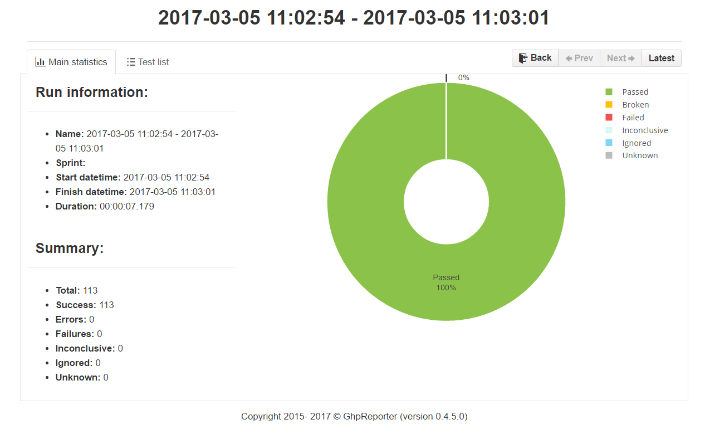

# Exercise 2.1

## Jenkins Build

I'm going to setup a simple jenkins build to compile and run the solution tests in order to generate a project artifact from the [Social Goal Github project](https://github.com/asg123/SocialGoal).

### Setup project

In the Jenkins server we have to create a new Freestyle project and give it a name. 

{:class="img-responsive"}

With the jenkins github plugins it is possible also to link the job with the github project repository.

{:class="img-responsive"}

### Clone solution

We have to setup the proper git URL so that source code is downloaded before starting the pipeline.

{:class="img-responsive"}

### Restore nuget packages

Before being able to build the solution we have to restore the Nuget packages. This can be done with a simple CMD call.

{:class="img-responsive"}

### Build Solution

With all the solution code and dependencies available we can build the project. First we need to add an MSBuild step.

{:class="img-responsive"}

And configure it to build the solution with the proper MSBuild configuration. The configuration has to be set in the Jenkins plugin settings page to use a proper MSBuild executable, in this case I'm using `C:\WINDOWS\Microsoft.NET\Framework\v4.0.30319\`.

{:class="img-responsive"}

### Run Tests

In order to verify that the compiled solution is correct we need to run the test projects availables. For this the [Nunit Console](https://github.com/nunit/nunit-console/releases/tag/3.6) has to be available for the Jenkins installation. It can be run with a CMD task.

{:class="img-responsive"}

### Output

With all this we can build the Jenkins project and confirm that the solution is build without issues.

```
Build succeeded.

"C:\Users\solas\.jenkins\workspace\SocialGoal\source\SocialGoal.sln" (default target) (1) ->
"C:\Users\solas\.jenkins\workspace\SocialGoal\source\SocialGoal\SocialGoal.Web.csproj" (default target) (2) ->
(ResolveAssemblyReferences target) -> 
  C:\Windows\Microsoft.NET\Framework\v4.0.30319\Microsoft.Common.targets(1605,5): warning MSB3247: Found conflicts between different versions of the same dependent assembly. [C:\Users\solas\.jenkins\workspace\SocialGoal\source\SocialGoal\SocialGoal.Web.csproj]

    1 Warning(s)
    0 Error(s)

Time Elapsed 00:00:01.09
[SocialGoal] $ cmd /c call C:\Users\solas\AppData\Local\Temp\hudson7350207192423804840.bat

C:\Users\solas\.jenkins\workspace\SocialGoal>D:\jenkins\NUnit.Console-3.6.0\nunit3-console.exe -work="C:\Users\solas\.jenkins\workspace\SocialGoal" "C:\Users\solas\.jenkins\workspace\SocialGoal\source\SocialGoal.Tests\bin\Debug\SocialGoal.Tests.dll" 
NUnit Console Runner 3.6.0 
Copyright (C) 2017 Charlie Poole

Runtime Environment
   OS Version: Microsoft Windows NT 10.0.14393.0
  CLR Version: 4.0.30319.42000

Test Files
    C:\Users\solas\.jenkins\workspace\SocialGoal\source\SocialGoal.Tests\bin\Debug\SocialGoal.Tests.dll

Test Run Summary
  Overall result: Passed
  Test Count: 113, Passed: 113, Failed: 0, Warnings: 0, Inconclusive: 0, Skipped: 0
  Start time: 2017-03-05 09:22:49Z
    End time: 2017-03-05 09:22:54Z
    Duration: 4.972 seconds

Results (nunit3) saved as TestResult.xml

C:\Users\solas\.jenkins\workspace\SocialGoal>exit 0 
Finished: SUCCESS
```

### Next Steps

Once compiled the solution we could be publishing the NUnit tests results to a location so that we can track history for test evolution. For instance we can use [GHPR](https://github.com/GHPReporter/Ghpr.NUnit) to generate an output report like this.

{:class="img-responsive"}

We could setup some Github hooks with jenkins so that every time a new commit is done to the project it is automatically integrated. It will be interesting also to add more quality metrics like code static analysis with a tool like [SonarQube](https://www.sonarqube.org/).

Finally with a post build action for succesfull builds we should move the generated build to an artifacts repository for next steps like deployment.