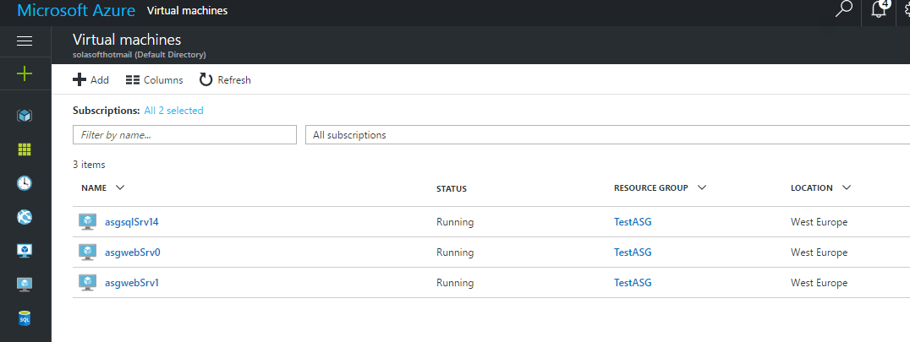
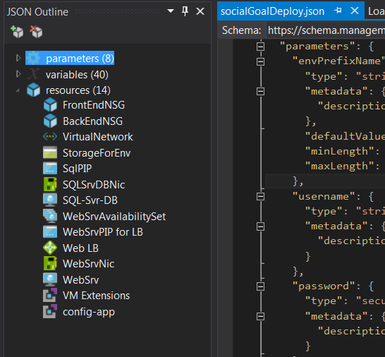

# Exercise 2.2.b.ii Cloud Provider Option

For the cloud provider I have chosen Azure as it has a lot of resources for .NET applications. To allow the solution to be easily integrated in a CI/CDD environment my choice has been Azure PowerShell Cmdlets for ARM that can be installed executing

```powershell
# Install the Azure Resource Manager modules from the PowerShell Gallery
Install-Module AzureRM
```

>Azure Resource Manager (ARM) is a service that allows to manage all the resources that you can create in Azure. JSON files can be used to describe the required infrastructure. [basic instructions](https://docs.microsoft.com/en-us/powershell/azureps-cmdlets-docs/)

The following are the commands that need to be executed to connect to an Azure account and that have to be integrated in a PowerShell script that can be triggered once the build process is complete from the Jenkins build.

```powershell
Login-AzureRmAccount
```

Once logged we can execute the following script to deploy the [template](azure/socialGoalDeploy.json). The script allows to parametrize many of the most parameters that we may want to change to bootstrap the infrastructure.

```powershell
#Requires -Version 3.0
#Requires -Module AzureRM.Resources

Param(
    [string] [Parameter(Mandatory=$true)] $ResourceGroupLocation,
    [string] $ResourceGroupName = 'SocialGoal',
    [string[ $Password,
    [string] $VmSize = "Standard_DS2",
    [string] $NumOfWebSrvs = "2",
    [string] $TemplateFile = "socialGoalDeploy.json",
    [string] $ResourceGroupName = "AzureSocialGoal",
    [string] $username = "asgwebsite",
    [string] $accountType = "Premium_LRS"
)

$SecurePwd = ConvertTo-SecureString $Password -AsPlainText -Force

New-AzureRmResourceGroup -Name $ResourceGroupName -Location $ResourceGroupLocation -Verbose -Force -ErrorAction Stop

New-AzureRmResourceGroupDeployment  -Name ((Get-ChildItem $TemplateFile).BaseName + '-' + ((Get-Date).ToUniversalTime()).ToString('MMdd-HHmm')) `
                                    -ResourceGroupName $ResourceGroupName `
                                    -TemplateUri $BasePath\_azuredeploy.json `
                                    -envPrefixName asg `
                                    -username $username -password $SecurePwd `
                                    -webSrvVMSize $VmSize -numberOfWebSrvs $NumOfWebSrvs `
                                    -sqlVMSize $VmSize `
                                    -storageAccountType $accountType `
                                    -database ""
```

This will be the output received confirming that the infrastructure has been created

```
DeploymentName          : ASGApp
ResourceGroupName       : TestASG
ProvisioningState       : Succeeded
Timestamp               : 03/03/2017 23:51:59
Mode                    : Incremental
TemplateLink            :
Parameters              :
                          Name             Type                       Value
                          ===============  =========================  ==========
                          envPrefixName    String                     asg
                          username         String                     asgwebsite
                          password         SecureString
                          webSrvVMSize     String                     Standard_DS2
                          numberOfWebSrvs  Int                        2
                          sqlVMSize        String                     Standard_DS2
                          storageAccountType  String                     Premium_LRS

Outputs                 :
DeploymentDebugLogLevel :
```

And in Azure control panel we can confirm that the machines have been created and are running.

{:class="img-responsive"}

## Template Details

I have started from a [template](https://azure.microsoft.com/en-us/resources/templates/iis-2vm-sql-1vm/) that creates two Windows Server 2012R2 VM(s) with IIS configured using DSC. It also installs one SQL Server 2014 standard edition VM, a VNET with two subnets, NSG, load balancer, NATing and probing rules. Notice that one of the best things about using modern infrastructure providers is the amount of resources available to start a project from a sample.

The template has been modified to include some custom sections to execute PowerShell scripts to deploy the web application and modify the configuration variables.

```json
    {
      "type": "Microsoft.Compute/virtualMachines/extensions",
      "name": "[concat(variables('webSrvName'), 'config-app']",
      "apiVersion": "[variables('apiVersion')]",
      "location": "[resourceGroup().location]",
      "dependsOn": [
        "[concat('Microsoft.Compute/virtualMachines/extensions', variables('webSrvName'), copyindex(),'/', variables('vmExtensionName'))]"
      ],
      "tags": {
        "displayName": "config-app"
      },
      "properties": {
        "publisher": "Microsoft.Compute",
        "type": "CustomScriptExtension",
        "typeHandlerVersion": "1.4",
        "autoUpgradeMinorVersion": true,
        "settings": {
          "fileUris": [
            "http://myStorage/deployWebApp.ps1"
          ]
        },
        "protectedSettings": {
          "commandToExecute": "[concat('powershell -ExecutionPolicy Unrestricted -File deployWebApp.ps1 -sqlserver ',variables('sqlPublicIP'))]"
        }
      }
    }
```

The modified azure deploy JSON template can be found in [this github folder](azure/socialGoalDeploy.json). Notice that, although those scripts can be created by hand, Visual Studio with the Azure tools offers the JSON Outline as a way to simplify and help locate definitions inside the infrastructure definition file.

{:class="img-responsive"}

The next script named `deployWebApp.ps1` will be the responsible to download and install the websites and will be executed on each web server machine create with the infrastructure definition.

```powershell
# Downloads and configures web app

Param (
    [parameter(mandatory=$true)] [string] $SqlServer,
    [parameter(mandatory=$true)] [string] $Artifact,
    [string] $TempDir = "c:\temp",
    [string] $AppDir = "c:\webApp",
    [string] $AppSiteName = "SocialGoal"
)

# Create working folders
New-Item -ItemType Directory $TempDir
New-Item -ItemType Directory $AppDir

# Download application to install
Invoke-WebRequest $Artifact -OutFile c:\temp\app.zip
Expand-Archive C:\temp\app.zip c:\webApp
Expand-Archive (Join-Path $TempDir -ChildPath $Artifact) $AppDir

# Prepare web config
$webConfig = Join-Path $AppDir -ChildPath "Web.config"
$doc = (Get-Content $webConfig) -as [Xml]
$root = $doc.get_DocumentElement();
$newCon = $root.connectionStrings.add.connectionString.Replace('Data Source=.\','Data Source=$SqlServer');
$root.connectionStrings.add.connectionString = $newCon
$doc.Save($webConfig)

# Configure iis
Remove-WebSite -Name "Default Web Site"
Set-ItemProperty IIS:\AppPools\DefaultAppPool\ managedRuntimeVersion ""
New-Website -Name $AppSiteName -Port 80 -PhysicalPath C:\webApp\ -ApplicationPool DefaultAppPool
& iisreset

```

This script will be copied at provisioning time to the azure web instances.

### Resources

The following resources are created by this template:

- 1 or 2 Windows 2012R2 IIS Web Servers.
- 1 SQL Server 2014 running on premium or standard storage.
- 1 virtual network with 2 subnets with NSG rules.
- 1 storage account for the VHD files.
- 1 Availability Set for IIS servers.
- 1 Load balancer with NATing rules.


## Architecture Diagram


[Back to home](README.md)