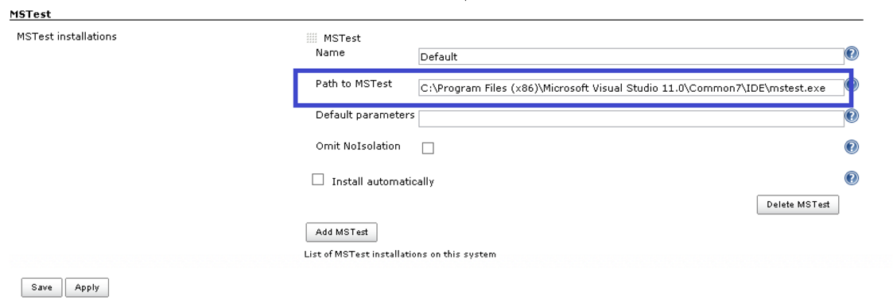

# Exercise 2

## Selenium Test Suite Implementation

Let's assume that the selenium test projects lives as an specific project in the same solution than the main project and that it's done using the same .NET technology. Selenium .NET projects that may be using the [Selenium WebDriver Support Classes](https://www.nuget.org/packages/Selenium.Support/) that have .NET support classes fot the Selenium WebDriver API. Selenium usually relies on a real web browser that needs to be present in the integration system. This is important as we need to identify the web browser where the tests are going to be executed as this is a dependency that needs to be satisfied in all the Jenkins agents. This is the list of browsers supported by the current web driver version.

It can use a headless browser but the most common case is to rely in some sort of UI so our integration server will need a GUI to open the browser.

The next step is to identify how our solution executes those tests, are a launched inside a console application, using NUnit... I will assume we have the tests running with [SpecFlow](https://www.nuget.org/packages/SpecFlow/) that matches quite well with the kind tests that are usually running in Selenium. SpecFlow BDD tests are created in the `feature` files that auto-generate c# code like this.

```c#
// ------------------------------------------------------------------------------
//  <auto-generated>
//      This code was generated by SpecFlow (http://www.specflow.org/).
//      SpecFlow Version:1.9.0.77
//      SpecFlow Generator Version:1.9.0.0
//      Runtime Version:4.0.30319.42000
// 
//      Changes to this file may cause incorrect behavior and will be lost if
//      the code is regenerated.
//  </auto-generated>
// ------------------------------------------------------------------------------
#region Designer generated code
#pragma warning disable
namespace Automation.Tests.Features
{
    using TechTalk.SpecFlow;

    [System.CodeDom.Compiler.GeneratedCodeAttribute("TechTalk.SpecFlow", "1.9.0.77")]
    [System.Runtime.CompilerServices.CompilerGeneratedAttribute()]
    [Microsoft.VisualStudio.TestTools.UnitTesting.TestClassAttribute()]
    public partial class Cycles1Feature
    {

        private static TechTalk.SpecFlow.ITestRunner testRunner;
...
```

As we can see in this generated code is using the [Visual Studio Unit Testing Framework](https://en.wikipedia.org/wiki/Visual_Studio_Unit_Testing_Framework) that uses `mstest.exe` to execute tests outside Visual Studio.

With all the requirements to execute we are ready to integrate the automated tests in the Jenkins job.

First we need to install and configure the [MSTest Plugin](https://wiki.jenkins-ci.org/display/JENKINS/MSTest+Plugin) with the path for the mstest executable. The easises way to have mstest is to install visual studio on the machine that will be used to run the build steps.

{:class="img-responsive"}

With this we can just add another CMD task in our build and deploy pipeline to make it call the Selenium tests after the deployment has been executed. Additionally we may need to adjust some URL or pass some parameters to the test to point to the right environment. There are different ways of telling mstest which tests should it run, for instance we can point to a DLL with the testcontainer attribute.

```cmd
MSTest.exe" /testcontainer:"%WORKSPACE%\src\Automation.Tests\bin\Debug\Automation.Tests.dll"
```

https://msdn.microsoft.com/en-us/library/ms182489.aspx
Failed tests can generate screenshots
rollback

```


[Back to home](README.md)